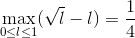

# gsea

## Introduction
Gene Set Enrichment Analysis (GSEA) is a powerful method for interpreting gene expression data. Instead of looking at individual genes it focuses on groups of genes that share a common biological function, chromosomal location, or regulation. This implementation of GSEA follows the description provided in Subramanian et al., Gene set enrichment analysis: A knowledge-based approach for interpreting genome-wide expression profiles, PNAS 102 (43): 15545-15550, 2005.

The source code is written in Python and resides in `gsea.py`. The three most important __functions__ are:
* `gsea` which computes normalized enrichment scores and the corresponding _p_-values based on the data in gene expression profiles,
* `plot` which displays Fig. 1 from the original paper: 
  * a heat map of gene expression profiles grouped by class,
  * gene expression correlation profile,
  * gene set member position in the profiles, 
  * the running sum (see the original paper).
* `my_gsea` which computes estimates of normalized enrichment scores and the corresponding _p_-values without gene expression profiles. A user-provided set of interesting genes is used instead.

Besides the source code three example __input files__ are provided:
* `leukemia.txt` contains gene expression profiles for two types of leukemia: acute lymphocytic leukemia (ALL) and acute myelogenous leukemia (AML),
* `pathways.txt` lists _a priori_ defined sets of genes enoding products in metabolic pathways,
* `my_genes.txt` contains a set of interesting genes from the literature.

`figure_1.png` shows an __example of output__ of the `plot` function for MAP00480_Glutathione_metabolism, one of the high scoring gene sets.

## Analytical approach to computation of enrichment score
Let's compute the enrichment score of a gene set containing a __single gene__. If this gene is important, i.e. at the top or at the bottom of the ranked gene list, the corresponding enrichment score ±1. If, on the other hand, this gene is not important and appears in the middle of the list, the corresponding enrichment score is going to be near ±1/2. After permuting gene expression profile classes, this single-gene set can appear anywhere in the ranked list, yielding an average enrichment score of ±3/4:

Therefore, the normalized enrichment score of the high scoring single-gene set is 4/3. Complexity grows quickly with the number of genes in the gene set. For __two genes__ in the gene set with the same correlation coefficient we obtain the enrichment score by numeric integration:

However, we need to be realistic. The two genes are unlikely to have the same value of correlation coefficient. The more different the correlation coefficients are, the closer the value of the second integral to the value of the first integral. In other words, if the two genes appear far apart in the ranked gene list, the smaller correlation can be neglected and the second integral approaches to the value for the one-gene set (the first integral).

The ratio of gene correlation coefficients is not trivial and depends on the detailed distribution of values in gene expression profiles.

The enrichment score of a large set of genes is again easy to compute. In this case we can visualize the running sum as the difference between a random walk (_p_-hit in the paper) characterized by the square root and a linear function (_p_-loss in the paper):

Knowing that the smallest enrichment score is 1/4 and the largest enrichment score is 1, the largest normalized enrichment score is 4. Large normalized enrichment scores occur in gene sets which contain both the important genes as determined by the ranked gene list and many non-important genes. In this case, the non-normalized enrichment score is determined by important genes and is close to 1 in value. In permuted scores non-important genes play the vital role in keeping the enrichment score low.

## Computation of enrichment score from gene expression profiles
After computing Pearson correlation coefficients from gene expression profiles and the corresponding classes, the running sum (see the original paper) is calculated, from which the enrichment score is obtained. This implementation scales linearly with the number of genes _N_ in gene expression profiles. It turns out that this approach provides the most efficient solution for small datasets, like the ones given in the example input files.

For large datasets, another approach is more efficient. The explicit computation of the running sum can be avoided by realizing that the extreme value of the running sum along the genes in gene expression profiles can occur only at positions of genes in the gene set for which the enrichment score is being calculated. Therefore, the running sum needs to be computed only at those positions, thereby reducing the overall computational effort. In this case gene expression profiles need to be structured as dicts instead of lists, resulting in computational efficiency of O(1) instead of O(_N_) in terms of the number of genes in gene expression profiles.

The `plot` function provides a visualization of computation of enrichment score.

## Computation of enrichment score without gene expression profiles
